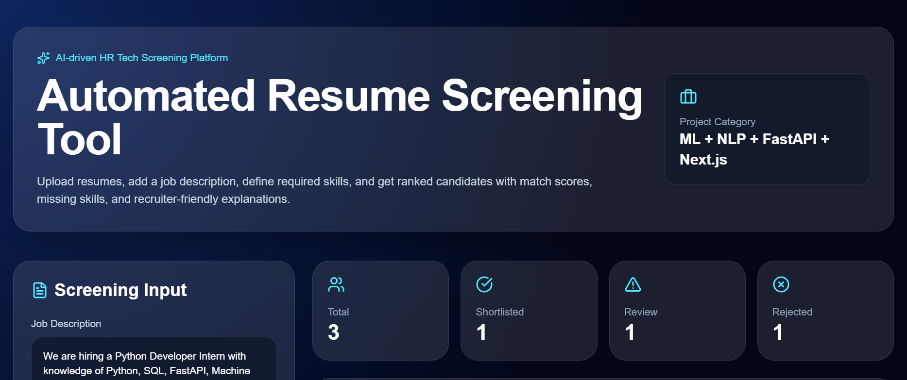
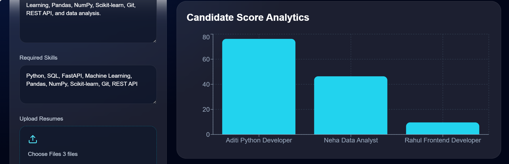
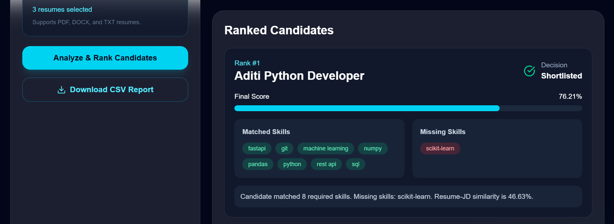
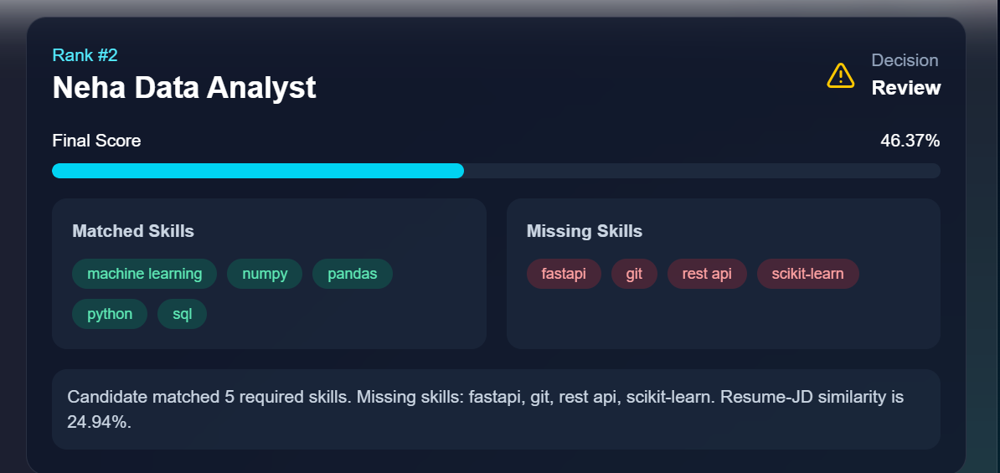
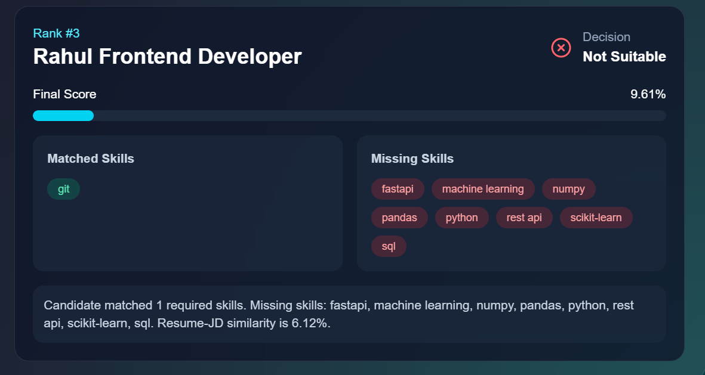

# Automated Resume Screening Tool

## 🚀 Project Overview

The **Automated Resume Screening Tool** is an AI-driven HR Tech application that helps recruiters automatically screen resumes based on a given job description and required skills.

The system extracts text from resumes, identifies candidate skills, compares resumes with job requirements using NLP techniques, calculates matching scores, ranks candidates, and generates shortlist decisions.

This project simulates a real Applicant Tracking System (ATS) workflow using Python, Machine Learning, NLP, FastAPI, and a premium Next.js recruiter dashboard.

---

# 🎯 Problem Statement

Recruiters often receive hundreds of resumes for a single role. Manually reviewing each resume is:

* time-consuming
* inconsistent
* repetitive
* inefficient

This project automates the initial screening process by:

* extracting resume text
* matching skills with job requirements
* calculating resume-job similarity
* ranking candidates automatically
* identifying missing skills
* generating shortlist decisions

---

# 🏢 Industry Relevance

Modern HR Tech companies and Applicant Tracking Systems use AI/NLP-based resume screening systems to:

* reduce manual recruitment effort
* improve hiring speed
* shortlist better candidates
* standardize resume evaluation
* improve recruitment efficiency

This project demonstrates concepts used in:

* ATS platforms
* HR automation systems
* AI recruitment tools
* resume ranking systems
* talent analytics platforms

---

# ✨ Features

✅ Upload multiple resumes
✅ Supports TXT, PDF, and DOCX resumes
✅ Dynamic job description input
✅ Dynamic required skills input
✅ Resume text extraction
✅ Text cleaning and preprocessing
✅ Skill extraction
✅ TF-IDF vectorization
✅ Cosine similarity scoring
✅ Resume ranking
✅ Shortlist / Review / Reject decision
✅ Matched and missing skills analysis
✅ CSV report generation
✅ FastAPI backend
✅ Premium Next.js recruiter dashboard
✅ Interactive analytics visualization
✅ CSV download button

---

# 🧠 System Workflow

```text
Resume Upload
      ↓
Text Extraction
      ↓
Text Cleaning
      ↓
Skill Extraction
      ↓
Job Description Matching
      ↓
TF-IDF Vectorization
      ↓
Cosine Similarity Scoring
      ↓
Final Score Calculation
      ↓
Candidate Ranking
      ↓
Shortlist / Review / Reject Decision
      ↓
CSV Report Generation
```

---

# 🏗 Project Architecture

```text
Frontend (Next.js + Tailwind CSS)
                ↓
         FastAPI Backend
                ↓
 Resume Processing Pipeline
                ↓
Text Extraction → Cleaning → Skill Matching
                ↓
TF-IDF + Cosine Similarity
                ↓
Score Calculation & Ranking
                ↓
CSV Report Generation
```

---

# 🛠 Tech Stack

## Backend

* Python
* FastAPI
* Uvicorn
* Pandas
* NumPy
* Scikit-learn
* pdfplumber
* python-docx
* TF-IDF
* Cosine Similarity

---

## Frontend

* Next.js
* TypeScript
* Tailwind CSS
* Axios
* Recharts
* Framer Motion
* Lucide React Icons

---

# 📁 Full Folder Structure

```text
Automated-Resume-Screening-Tool/
│
├── backend/
│   │
│   ├── api/
│   │   └── app.py
│   │
│   ├── src/
│   │   ├── text_extractor.py
│   │   ├── text_cleaner.py
│   │   ├── skill_matcher.py
│   │   ├── scorer.py
│   │   └── report_generator.py
│   │
│   ├── uploads/
│   ├── requirements.txt
│   ├── data_skills.py
│   └── main.py
│
├── frontend/
│   ├── app/
│   ├── public/
│   ├── package.json
│   └── ...
│
├── resumes/
│   ├── aditi_python_developer.txt
│   ├── neha_data_analyst.txt
│   └── rahul_frontend_developer.txt
│
├── outputs/
│   ├── screening_results.csv
│   └── shortlisted_candidates.csv
│
├── images/
│   ├── dashboard_home.png
│   ├── ranked_candidates.png
│   ├── candidate_score_analytics.png
│   ├── shortlisted_candidate.png
│   ├── review_candidate.png
│   └── not_suitable_candidate.png
│
├── docs/
│
├── README.md
├── .gitignore
└── package-lock.json
```

---

# 🔬 Virtual Simulation

Since this is a student project and real ATS data is unavailable, the project uses simulated recruiter workflows.

---

## 👨‍💼 How the Simulation Works

### 1. Sample Resume Creation

Sample resumes are created for different candidate types:

* Python Developer
* Data Analyst
* Frontend Developer

Each resume contains:

* education
* skills
* projects
* experience

---

### 2. Job Description Creation

A recruiter job description is manually entered in the dashboard.

Example:

```text
Python Developer Intern with knowledge of Python, SQL, FastAPI, Machine Learning, Pandas, NumPy, Scikit-learn, Git, and REST API.
```

---

### 3. Required Skills Input

The recruiter enters required skills dynamically.

Example:

```text
Python, SQL, FastAPI, Machine Learning, Pandas, NumPy, Scikit-learn, Git, REST API
```

---

### 4. Resume Text Extraction

The system extracts text from:

* PDF resumes
* DOCX resumes
* TXT resumes

---

### 5. Skill Matching

The system checks:

* matched skills
* missing skills

---

### 6. Similarity Calculation

TF-IDF + cosine similarity compare:

```text
Resume ↔ Job Description
```

---

### 7. Final Ranking

Final score is calculated using weighted scoring:

```text
70% Skill Match Score
30% Resume-JD Similarity
```

---

### 8. Final Decision

```text
Score ≥ 75% → Shortlisted
Score ≥ 40% → Review
Score < 40% → Not Suitable
```

---

# ⚙️ Complete Installation Guide

---

# 1️⃣ Clone Repository

```bash
git clone https://github.com/YOUR_USERNAME/Automated-Resume-Screening-Tool.git
```

Move into folder:

```bash
cd Automated-Resume-Screening-Tool
```

---

# 2️⃣ Create Virtual Environment

Move to backend folder:

```bash
cd backend
```

---

## Windows

```bash
python -m venv venv
```

Activate virtual environment:

```bash
venv\Scripts\activate
```

---

## Mac/Linux

```bash
python3 -m venv venv
```

Activate:

```bash
source venv/bin/activate
```

---

# 3️⃣ Install Dependencies

Install backend dependencies:

```bash
pip install -r requirements.txt
```

---

# 4️⃣ Run FastAPI Backend

```bash
uvicorn api.app:app --reload
```

Backend runs on:

```text
http://127.0.0.1:8000
```

Swagger API docs:

```text
http://127.0.0.1:8000/docs
```

---

# 5️⃣ Run Frontend

Open another terminal.

Move to frontend:

```bash
cd frontend
```

Install frontend dependencies:

```bash
npm install
```

Run frontend:

```bash
npm run dev
```

Frontend runs on:

```text
http://localhost:3000
```

---

# ▶️ Run Complete Pipeline

## Step-by-Step Workflow

1. Start backend server
2. Start frontend server
3. Open dashboard
4. Upload resumes
5. Enter job description
6. Enter required skills
7. Click:

```text
Analyze & Rank Candidates
```

8. System processes resumes
9. Dashboard displays ranking results
10. Download CSV report

---

# 📊 Sample Model Results

| Rank | Candidate                |  Score | Decision     |
| ---- | ------------------------ | -----: | ------------ |
| 1    | Aditi Python Developer   | 76.21% | Shortlisted  |
| 2    | Neha Data Analyst        | 46.37% | Review       |
| 3    | Rahul Frontend Developer |  9.61% | Not Suitable |

---

# 🔑 Key Insights

* Python Developer profile achieved highest score due to strong skill matching.
* Data Analyst profile matched partially because of missing backend/API skills.
* Frontend Developer profile scored lowest because job requirements focused on Python and ML.
* TF-IDF similarity improved ranking accuracy.
* Skill extraction provided explainable recruiter decisions.

---

# 📄 Generated Outputs

The project generates:

```text
outputs/screening_results.csv
```

CSV report includes:

* Rank
* Candidate Name
* Final Score
* Decision
* Skill Score
* Similarity Score
* Matched Skills
* Missing Skills
* Explanation

---

# 📸 Screenshots

## Dashboard Home



---

## Candidate Score Analytics



---

## Ranked Candidates



---

## Shortlisted Candidate


---

## Review Candidate



---

## Not Suitable Candidate



---

# 📚 Key Learnings

Through this project, I learned:

* Resume parsing using Python
* PDF and DOCX text extraction
* Text preprocessing and cleaning
* Skill extraction logic
* TF-IDF vectorization
* Cosine similarity scoring
* Weighted scoring systems
* Candidate ranking logic
* FastAPI backend development
* API integration with Next.js
* Tailwind CSS dashboard development
* CSV report generation
* Building an end-to-end AI/NLP project

---

# 🚀 Future Improvements

* Drag-and-drop resume upload
* Recruiter login authentication
* Database integration
* Semantic embeddings using transformers
* Resume parsing using LLMs
* Candidate filtering by experience
* PDF report generation
* Cloud deployment
* Real ATS integration
* Bias and fairness analysis
* AI-generated recruiter recommendations

---

# 📅 Proof Building Strategy

## Day 1

* Project setup
* Folder structure
* Dependency installation

---

## Day 2

* Resume text extraction
* PDF/DOCX processing

---

## Day 3

* Job description matching
* Skill extraction

---

## Day 4

* TF-IDF + cosine similarity
* Ranking system

---

## Day 5

* Dashboard integration
* CSV report generation

---

## Day 6

* Documentation
* GitHub upload
* README creation
* Screenshots

---

# 💻 GitHub Topics

```text
python
machine-learning
nlp
fastapi
nextjs
resume-screening
ats
hr-tech
tfidf
cosine-similarity
tailwindcss
portfolio-project
```

---

# 👩‍💻 Author

## Vaidehi Deore

# ⭐ Final Note

This project demonstrates how AI and NLP can automate resume screening workflows and help recruiters make faster, data-driven hiring decisions using modern full-stack technologies.